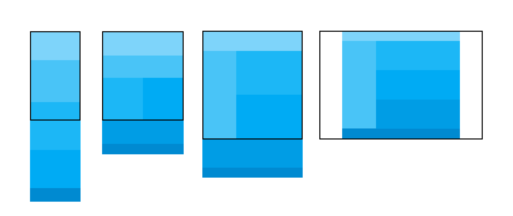

# ResponsiveWeb
> This repository is for tutorials of the responsive website.
> 
> Responsive website link: https://standardresponsiveweb.netlify.app/
> 
> Tutorial link : https://youtu.be/52TT7SLexxE (in Korean)

<!-- CONTENTS -->
## Contents
* Layout: HTML / CSS (and a little bit of jQuery)
* Responsive web: HTML / CSS / JavaScript

<!-- REFLECTION -->
## What I've learned
* Blend effect
* Hover effect with `transform-style: preserve-3d`
* Lots of bugs with this project -> Lots of debugging! (mostly typo)

<!-- OVERVIEW -->
## Overview

### Responsive Website

|  Header menu animation  |
|-----------------|
| |

|  Side and Expandable menu  |
|-----------------|
| |

|  Blend effect  |
|-----------------|
| |

|  slick slider |
|-----------------|
| |

| Mouse hover effect 1 | Mouse hover effect 2 | Mouse hover effect 3 |
|-----------------|-----------------|-----------------|
| | | |

### Layout

|  Media Query  |
|-----------------|
| |

| Layout 01  |
|-----------------|
| |

| Layout 02  |
|-----------------|
| |

| Layout 03  |
|-----------------|
| |

| Layout 04  |
|-----------------|
| |

| Layout 05  |
|-----------------|
| |

<!-- CONTACT -->
## Contact

Sam Lee - [@LinkedIn](https://www.linkedin.com/in/sam-lee-dev/) - LeeSam235711@gmail.com

(<a href="#top">back to top</a>)

